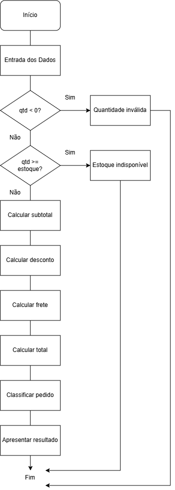

# TESTE DE CAIXA BRANCA

**Sistema de Pedidos — Loja SENAI**

* **Nome da instituição:** SENAI
* **Curso:** Desenvolvimento de Sistemas
* **Unidade curricular:** Testes de Software
* **Nome do aluno:** Bruno Adala Vaz de Oliveira
* **Turma:** 2DES-B
* **Professor:** Robson Souza
* **Data:** 30/09/2026

---

## 1. Contextualização sobre Teste de Caixa Branca

O teste de caixa branca é uma técnica de teste de software que considera a estrutura interna do código-fonte. Por meio dessa técnica, é possível analisar comandos, condições, decisões, variáveis e diferentes caminhos que podem ser percorridos durante a execução de um programa.

Nesta atividade foi analisado um sistema de pedidos desenvolvido utilizando HTML, CSS e JavaScript. A interface permite selecionar um produto, informar sua quantidade, inserir um cupom de desconto e escolher uma modalidade de frete.

O processamento do pedido é realizado pelo JavaScript. O programa possui informações de preços e estoque para notebook, mouse e teclado. Durante o processamento são realizadas validações e cálculos relacionados à quantidade, estoque, descontos, frete e valor final do pedido.

O objetivo desta atividade é utilizar técnicas de teste de caixa branca para identificar caminhos de execução que apresentam comportamentos diferentes dos esperados, demonstrando cada situação por meio de casos de teste e fluxogramas.

---

## 2. Análise das Estruturas de Decisão

### 2.1 Validação da quantidade
```javascript
if (qtd < 0) {
    resultado.innerHTML = "<p>Quantidade inválida.</p>";
    return;
}
```
* **Descrição:** Verifica se a quantidade é negativa.

### 2.2 Verificação do estoque
```javascript
if (qtd >= estoque[produtoSelecionado]) {
    resultado.innerHTML = "<p>Quantidade indisponível em estoque.</p>";
    return;
}
```
* **Descrição:** Compara a quantidade solicitada com o estoque.

### 2.3 Cupom SENAI10
```javascript
if (codigo === "SENAI10") {
    return subtotal * 0.10;
}
```
* **Descrição:** Aplica desconto de 10% quando o cupom é `SENAI10`.

### 2.4 Cupom SENAI20
```javascript
if (codigo === "SENAI20" && subtotal >= 1000) {
    return subtotal * 0.20;
}
```
* **Descrição:** Aplica 20% quando o cupom é `SENAI20` e o subtotal é pelo menos R\$ 1.000.

### 2.5 Cálculo do frete
```javascript
if (tipo === "retirada") return 0;
if (tipo === "expresso") return 60;
if (subtotal >= 500) return 0;
return 30;
```
* **Descrição:** Define o valor do frete conforme a modalidade e o subtotal.

### 2.6 Desconto por quantidade
```javascript
if (qtd > 5) {
    total = total - subtotal * 0.05;
}
```
* **Descrição:** Aplica 5% quando a quantidade é maior que cinco.

### 2.7 Desconto para alto valor
```javascript
if (total > 3000) {
    total = total * 0.95;
}
```
* **Descrição:** Aplica 5% quando o total é superior a R$ 3.000.

### 2.8 Classificação
```javascript
if (total <= 0) {
    mensagem = "Valor do pedido inválido.";
} else if (total >= 3000) {
    mensagem = "Pedido de alto valor.";
}
```
* **Descrição:** Classifica pedidos inválidos e pedidos de alto valor.

---

## 3. Fluxograma do Exemplo



---

## 4. Casos de Teste

| Identificação | Entrada | Condição/Caminho | Resultado Esperado | 
| --- | --- | --- | --- |
| CT01 | Mouse / quantidade 0 | Validação da quantidade | Quantidade inválida |
| CT02 | Mouse / quantidade 20 | Limite do estoque | Pedido permitido |
| CT03 | Mouse / quantidade 5 | Desconto por quantidade | Aplicação do desconto |
| CT04 | Mouse / quantidade 7 | Subtotal >= R$500 | Frete grátis |
| CT05 | Notebook / quantidade 1 / retirada | Total = R$3000 | Tratamento de alto valor consistente |
| CT06 | Mouse / quantidade 6 / SENAI10 | Dois descontos | Descontos calculados corretamente |

---

## 5. Resultados dos Testes

| Identificação | Entrada | Resultado Esperado | Resultado Obtido | Situação |
| --- | --- | --- | --- | --- |
| CT01 | Mouse / qtd. 0 | Quantidade inválida | Pedido processado | Falhou |
| CT02 | Mouse / qtd. 20 | Pedido permitido | Estoque indisponível | Falhou |
| CT03 | Mouse / qtd. 5 | Desconto aplicado | Sem desconto | Falhou |
| CT04 | Mouse / qtd. 7 | Frete grátis | Frete grátis | Passou |
| CT05 | Mouse / qtd. 1 / retirada | Tratamento consistente | Alto valor sem desconto | Falhou |
| CT06 | Mouse / qtd. 6 / SENAI10| R$ 440,40 | R$ 438,00 | Falhou |

---

## 6. Análise dos Resultados

Os testes demonstraram que diferentes valores de entrada fazem o programa seguir caminhos diferentes. Os testes de valores-limite foram especialmente importantes para as condições de quantidade, estoque e valor do pedido.

Também foi realizado o rastreamento das variáveis subtotal, desconto, valorFrete e total. Isso permitiu observar como cada decisão alterava o resultado final.

O teste de frete a partir de R$ 500 apresentou o comportamento correspondente à condição existente no código e, portanto, foi tratado como teste de cobertura, não como erro.

---

## 7. Conclusão

A realização do teste de caixa branca permitiu analisar a estrutura interna do sistema de pedidos e identificar diferentes caminhos de execução.

A análise de decisões, valores-limite, condições e rastreamento de variáveis mostrou como pequenas diferenças nos operadores relacionais podem alterar o comportamento do sistema.

Após as correções propostas, os casos de teste podem ser executados novamente para verificar se os comportamentos identificados foram corrigidos.